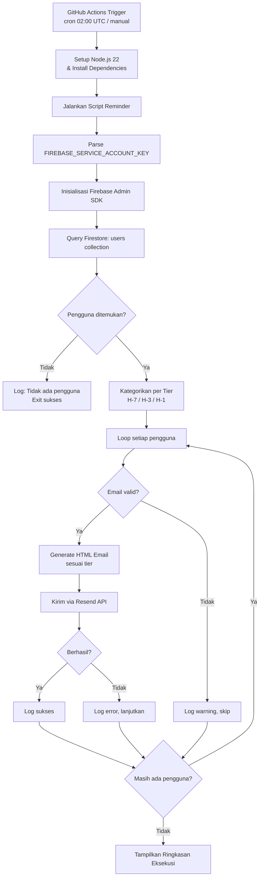
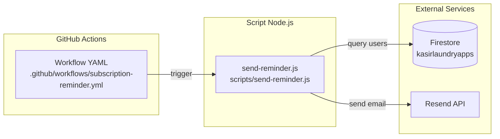

# Dokumen Desain: Subscription Reminder

## Ikhtisar (Overview)

Sistem Subscription Reminder adalah script Node.js yang berjalan sebagai GitHub Actions workflow terjadwal untuk mengirimkan email pengingat kepada pengguna Sikasir Laundry yang masa langganannya akan segera berakhir. Script ini melakukan query ke Firestore untuk mengidentifikasi pengguna berdasarkan tiga tier (H-7, H-3, H-1), lalu mengirimkan email HTML bertingkat melalui layanan Resend.

### Alur Utama



### Keputusan Desain

1. **Single script approach**: Seluruh logika ditempatkan dalam satu file `scripts/send-reminder.js` karena scope fitur terbatas dan tidak memerlukan arsitektur kompleks. Fungsi-fungsi dipisahkan secara modular di dalam file yang sama untuk testability.
2. **Query per-tier terpisah**: Tiga query Firestore terpisah (satu per tier) dilakukan alih-alih satu query besar, karena setiap tier memiliki rentang tanggal berbeda dan ini mempermudah kategorisasi.
3. **Sequential email sending**: Email dikirim secara sequential (bukan parallel) untuk menghindari rate limiting dari Resend API dan mempermudah error tracking.
4. **Fail-forward pattern**: Kegagalan pengiriman email ke satu pengguna tidak menghentikan proses. Error dicatat dan proses berlanjut ke pengguna berikutnya.

## Arsitektur (Architecture)

### Komponen Sistem



### Struktur File

```
.github/
  workflows/
    subscription-reminder.yml    # GitHub Actions workflow definition
scripts/
  send-reminder.js               # Script utama reminder
  package.json                   # Dependensi: firebase-admin, resend
```

### Environment Variables

| Variable | Sumber | Deskripsi |
|----------|--------|-----------|
| `FIREBASE_SERVICE_ACCOUNT_KEY` | GitHub Secret | JSON string berisi kredensial service account Firebase |
| `RESEND_API_KEY` | GitHub Secret | API key untuk layanan Resend |

